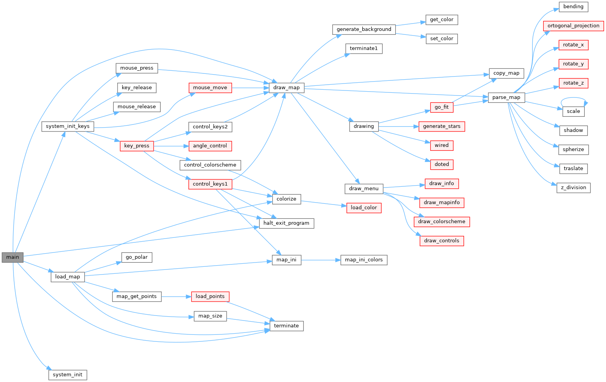
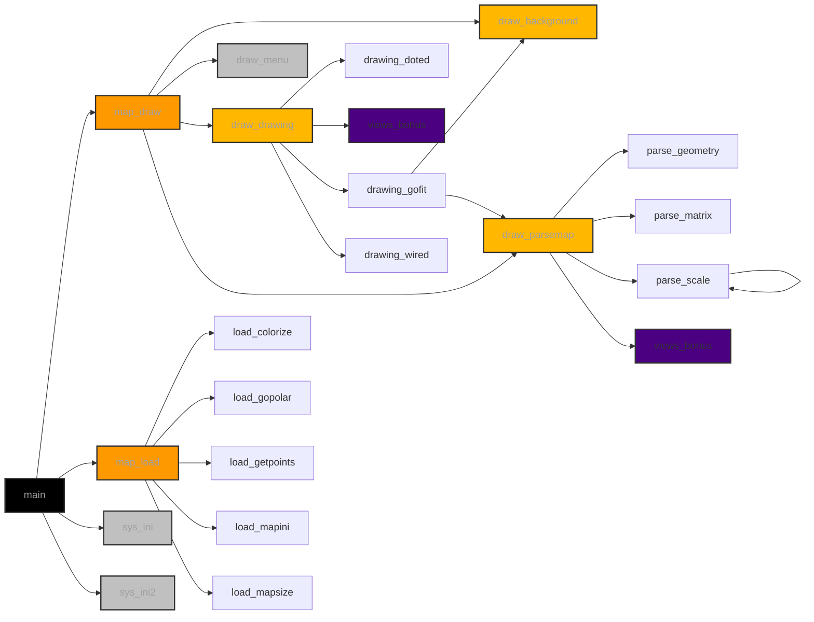
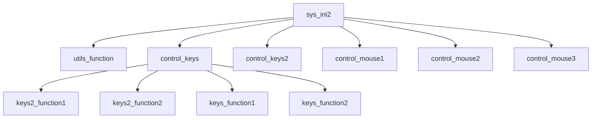
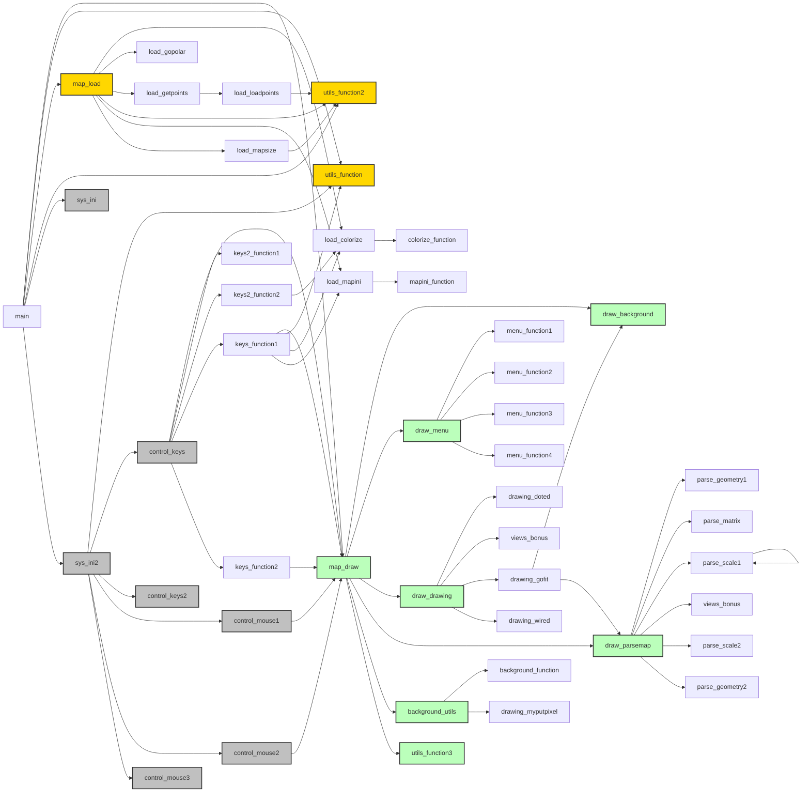

# FLOW CHARTS

 
 
 
 
 
 

---

``` mermaid
flowchart LR
classDef black fill:#000,stroke:#333,stroke-width:2px,color:#a0a0a0;
classDef silver fill:#c0c0c0,stroke:#333,stroke-width:2px, color:#a0a0a0;
classDef red fill:#a52a2a,stroke:#333,stroke-width:2px;
classDef orange1 fill:#f90,stroke:#333,stroke-width:2px,color:#a0a0a0;
classDef orange2 fill:#ffa700,stroke:#333,stroke-width:2px,color:#a0a0a0;
classDef yellow1 fill:#ffb700,stroke:#333,stroke-width:2px,color:#a0a0a0;
classDef yellow2 fill:#ffd700,stroke:#333,stroke-width:2px,color:#a0a0a0;
classDef gold fill:#fff700,stroke:#333,stroke-width:2px,color:#a0a0a0;

classDef blue fill:#bbf,stroke:#333,stroke-width:2px,color:#a0a0a0;
classDef green fill:#bfb,stroke:#333,stroke-width:2px;
classDef green1 fill:#ffb,stroke:#333,stroke-width:2px,color:#a0a0a0;
classDef purple fill:#d0b,stroke:#333,stroke-width:2px;

classDef indigo fill:#4b0082,stroke:#333,stroke-width:2px;

    Node000001["main"] --> Node000002["map_draw"]
    Node000001 --> Node000041["map_load"]
    Node000001 --> Node000053["sys_ini"]
    Node000001 --> Node000054["sys_ini2"]

    Node000002 --> Node000003["draw_background"]
    Node000002 --> Node000004["draw_menu"]
    Node000002 --> Node000011["draw_drawing"]
    Node000002 --> Node000020["draw_parsemap"]
    
    Node000011 --> Node000012["drawing_doted"]
    Node000011 --> Node000017["views_bonus"]
    Node000011 --> Node000018["drawing_gofit"]
    Node000011 --> Node000032["drawing_wired"]
    
    Node000018 --> Node000003
    Node000018 --> Node000020
    
    Node000020 --> Node000021["parse_geometry"]
    Node000020 --> Node000022["parse_matrix"]
    Node000020 --> Node000027["parse_scale"]
    Node000020 --> Node000028["views_bonus"]
    
    Node000027 --> Node000027
    
    Node000041 --> Node000042["load_colorize"]
    Node000041 --> Node000044["load_gopolar"]
    Node000041 --> Node000045["load_getpoints"]
    Node000041 --> Node000050["load_mapini"]
    Node000041 --> Node000052["load_mapsize"]
	
	class Node000001 black
	class Node000053,Node000054,Node000004 silver
	class Node000002,Node000041 orange1
	class Node000011,Node000020,Node000003 yellow1
	
	class Node000017,Node000028 indigo
```
---

 
 
 
 
 
 

---

``` mermaid
flowchart TD   
    Node000054["sys_ini2"] --> Node000040["utils_function"]
    Node000054 --> Node000055["control_keys"]
    Node000054 --> Node000064["control_keys2"]
    Node000054 --> Node000065["control_mouse1"]
    Node000054 --> Node000066["control_mouse2"]
    Node000054 --> Node000067["control_mouse3"]

    Node000055 --> Node000056["keys2_function1"]
    Node000055 --> Node000058["keys2_function2"]
    Node000055 --> Node000059["keys_function1"]
    Node000055 --> Node000061["keys_function2"]    
```
---

 
 
 
 
 
 

---

``` mermaid
flowchart LR
classDef pink fill:#f9f,stroke:#333,stroke-width:2px;
classDef blue fill:#bbf,stroke:#333,stroke-width:2px;
classDef green fill:#bfb,stroke:#333,stroke-width:2px;
classDef yellow fill:#ffb,stroke:#333,stroke-width:2px;
classDef red fill:#fbb,stroke:#333,stroke-width:2px;
classDef purple fill:#d0b,stroke:#333,stroke-width:2px;
classDef orange fill:#f90,stroke:#333,stroke-width:2px;
classDef cyan fill:#0ff,stroke:#333,stroke-width:2px;
classDef lime fill:#9f9,stroke:#333,stroke-width:2px;
classDef brown fill:#a52a2a,stroke:#333,stroke-width:2px;
classDef silver fill:#c0c0c0,stroke:#333,stroke-width:2px;
classDef gold fill:#ffd700,stroke:#333,stroke-width:2px;
classDef coral fill:#ff7f50,stroke:#333,stroke-width:2px;
classDef indigo fill:#4b0082,stroke:#333,stroke-width:2px;
classDef violet fill:#ee82ee,stroke:#333,stroke-width:2px;

    Node000001["main"] --> Node000002["map_draw"]
    Node000001 --> Node000040["utils_function"]
    Node000001 --> Node000041["map_load"]
    Node000001 --> Node000048["utils_function2"]
    Node000001 --> Node000053["sys_ini"]
    Node000001 --> Node000054["sys_ini2"]

    Node000002 --> Node000003["draw_background"]
    Node000002 --> Node000004["draw_menu"]
    Node000002 --> Node000011["draw_drawing"]
    Node000002 --> Node000020["draw_parsemap"]
    Node000002 --> Node000037["background_utils"]
    Node000002 --> Node000039["utils_function3"]
    
    Node000004 --> Node000005["menu_function1"]
    Node000004 --> Node000007["menu_function2"] 
    Node000004 --> Node000008["menu_function3"]
    Node000004 --> Node000010["menu_function4"]
    
    Node000011 --> Node000012["drawing_doted"]
    Node000011 --> Node000017["views_bonus"]
    Node000011 --> Node000018["drawing_gofit"]
    Node000011 --> Node000032["drawing_wired"]
    
    Node000018 --> Node000003
    Node000018 --> Node000020
    
    Node000020 --> Node000021["parse_geometry1"]
    Node000020 --> Node000022["parse_matrix"]
    Node000020 --> Node000027["parse_scale1"]
    Node000020 --> Node000028["views_bonus"]
    Node000020 --> Node000030["parse_scale2"]
    Node000020 --> Node000031["parse_geometry2"]
    
    Node000027 --> Node000027
    
    Node000037 --> Node000038["background_function"]
    Node000037 --> Node000016["drawing_myputpixel"]
    
    Node000041 --> Node000042["load_colorize"]
    Node000041 --> Node000044["load_gopolar"]
    Node000041 --> Node000045["load_getpoints"]
    Node000041 --> Node000048
    Node000041 --> Node000050["load_mapini"]
    Node000041 --> Node000052["load_mapsize"]
    
    Node000042 --> Node000043["colorize_function"]
    
    Node000045 --> Node000046["load_loadpoints"]
    
    Node000046 --> Node000048
    
    Node000050 --> Node000051["mapini_function"]
    
    Node000052 --> Node000048
    
    Node000054 --> Node000040
    Node000054 --> Node000055["control_keys"]
    Node000054 --> Node000064["control_keys2"]
    Node000054 --> Node000065["control_mouse1"]
    Node000054 --> Node000066["control_mouse2"]
    Node000054 --> Node000067["control_mouse3"]
    
    Node000055 --> Node000002
    Node000055 --> Node000056["keys2_function1"]
    Node000055 --> Node000058["keys2_function2"]
    Node000055 --> Node000059["keys_function1"]
    Node000055 --> Node000061["keys_function2"]
    
    Node000058 --> Node000042
    
    Node000059 --> Node000002
    Node000059 --> Node000040
    Node000059 --> Node000042
    Node000059 --> Node000050
    
    Node000061 --> Node000002
    
    Node000065 --> Node000002
    
    Node000066 --> Node000002

class Node000001 black;

class Node000053,Node000054 silver
class Node000055,Node000064,Node000065,Node000066,Node000067 silver;

class Node000002,Node000003,Node000004,Node000011,Node000020,Node000037,Node000039 green;
class Node000040,Node000041,Node000048 gold;
```