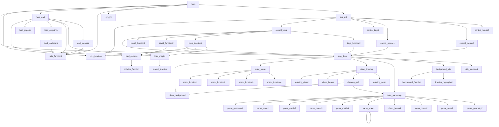

  

``` mermaid
flowchart TD
    Node000001["main"] --> Node000002["map_draw"]
    Node000001 --> Node000040["utils_function"]
    Node000001 --> Node000041["map_load"]
    Node000001 --> Node000048["utils_function2"]
    Node000001 --> Node000053["sys_ini"]
    Node000001 --> Node000054["sys_ini2"]

    Node000002 --> Node000003["draw_background"]
    Node000002 --> Node000004["draw_menu"]
    Node000002 --> Node000011["draw_drawing"]
    Node000002 --> Node000020["draw_parsemap"]
    Node000002 --> Node000037["background_utils"]
    Node000002 --> Node000039["utils_function3"]
    
    Node000004 --> Node000005["menu_function1"]
    Node000004 --> Node000007["menu_function2"] 
    Node000004 --> Node000008["menu_function3"]
    Node000004 --> Node000010["menu_function4"]
    
    Node000011 --> Node000012["drawing_doted"]
    Node000011 --> Node000017["views_bonus"]
    Node000011 --> Node000018["drawing_gofit"]
    Node000011 --> Node000032["drawing_wired"]
    
    Node000018 --> Node000003
    Node000018 --> Node000020
    
    Node000020 --> Node000021["parse_geometry1"]
    Node000020 --> Node000022["parse_matrix1"]
    Node000020 --> Node000024["parse_matrix2"]
    Node000020 --> Node000025["parse_matrix3"]
    Node000020 --> Node000026["parse_matrix4"]
    Node000020 --> Node000027["parse_scale1"]
    Node000020 --> Node000028["views_bonus1"]
    Node000020 --> Node000029["views_bonus2"]
    Node000020 --> Node000030["parse_scale2"]
    Node000020 --> Node000031["parse_geometry2"]
    
    Node000027 --> Node000027
    
    Node000037 --> Node000038["background_function"]
    Node000037 --> Node000016["drawing_myputpixel"]
    
    Node000041 --> Node000042["load_colorize"]
    Node000041 --> Node000044["load_gopolar"]
    Node000041 --> Node000045["load_getpoints"]
    Node000041 --> Node000048
    Node000041 --> Node000050["load_mapini"]
    Node000041 --> Node000052["load_mapsize"]
    
    Node000042 --> Node000043["colorize_function"]
    
    Node000045 --> Node000046["load_loadpoints"]
    
    Node000046 --> Node000048
    
    Node000050 --> Node000051["mapini_function"]
    
    Node000052 --> Node000048
    
    Node000054 --> Node000040
    Node000054 --> Node000055["control_keys"]
    Node000054 --> Node000064["control_keys2"]
    Node000054 --> Node000065["control_mouse1"]
    Node000054 --> Node000066["control_mouse2"]
    Node000054 --> Node000067["control_mouse3"]
    
    Node000055 --> Node000002
    Node000055 --> Node000056["keys2_function1"]
    Node000055 --> Node000058["keys2_function2"]
    Node000055 --> Node000059["keys_function1"]
    Node000055 --> Node000061["keys_function2"]
    
    Node000058 --> Node000042
    
    Node000059 --> Node000002
    Node000059 --> Node000040
    Node000059 --> Node000042
    Node000059 --> Node000050
    
    Node000061 --> Node000002
    
    Node000065 --> Node000002
    
    Node000066 --> Node000002
```

